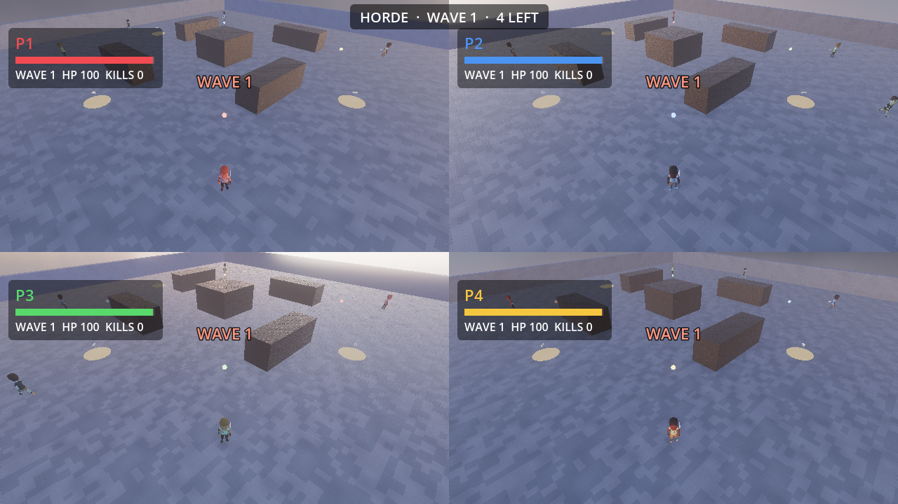
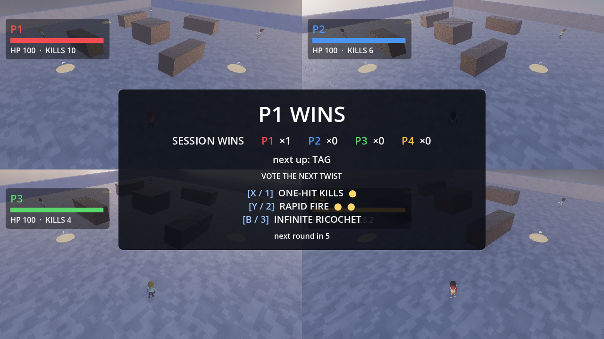

# Couch Arena

A 3D split-screen arena shooter for Windows, for two to four people on one
couch and one screen. Built with [Godot 4.7](https://godotengine.org).

Players join by pressing a button on any connected controller, and the screen
re-partitions itself as they come and go. Rounds rotate through a set of short
game modes — some co-op, some versus — with a session scoreboard in between.
Plug in a pad, press A, press Start.

| Mode | Players | The idea |
| --- | --- | --- |
| **Horde** | 1–4, co-op | Survive escalating waves of zombies. Stand by a downed friend to revive them. |
| **Deathmatch** | 2–4 | Every kill is a point. First to ten. |
| **Tag** | 2–4 | Don't be it. Touch someone to pass it on. No guns. |
| **King of the Hill** | 2–4 | Hold the centre alone for thirty seconds. |
| **Ball Game** | 2v2 | Shoot or shove the ball into the other team's goal. |

Weapon pickups sit around the arena: a scatter gun and a rail gun with a
fixed clip each. Every shot bounces off cover once, so bank shots are a thing. A tie at the
whistle goes to sudden death. Between rounds everyone votes on a mutator for
the next one — one-hit kills, infinite ricochet, fast feet, rapid fire, glass
cannon. In deathmatch, killing whoever is ahead is worth double.





## Status

Early, but every mode above is playable end to end, and the screenshot is a
real frame from the project (horde, four players, zombies closing in), not a
mockup.

It has **not** been played on real hardware with real controllers. Movement
feel, camera comfort and controller compatibility are all unverified, and that
is the next job. See [docs/ROADMAP.md](docs/ROADMAP.md).

All art is CC0 — see [docs/ASSETS.md](docs/ASSETS.md) for sources and the
import pipeline.

## Controls

| Action | Gamepad | Keyboard |
| --- | --- | --- |
| Join | `A` or `Start` | `Enter` |
| Move | Left stick | `W` `A` `S` `D` |
| Aim | Right stick | Arrow keys |
| Fire | Right trigger, `RB`, or `A` | `Space` |
| Start the round (lobby) | `Start` | `Enter` |
| Change next mode (lobby) | D-pad ◄ ► | `Tab` |
| Vote on the next mutator (results) | `X` / `Y` / `B` | `1` / `2` / `3` |

Up to four gamepads are supported, plus one keyboard seat. The keyboard seat
exists so the game can be launched and checked without controllers attached;
it is not meant as a way to play seriously.

## Running it

Install [Godot 4.7](https://godotengine.org/download) — a single executable,
no installer and no SDK. Then either open `project.godot` in the editor and
press F5, or from the command line:

```bash
godot --path .
```

## Exporting for Windows

In the editor: **Project → Export**, add a Windows Desktop preset, install the
export templates when prompted, and export. The result is a standalone `.exe`
plus a `.pck` data file.

## Development

```bash
# Headless test suite: geometry, input maths, and the join/spawn/score path.
godot --headless --path . --script res://tests/run_tests.gd

# Re-render docs/split-screen.png (horde) and docs/results.png (results screen).
VK_ICD_FILENAMES=/usr/share/vulkan/icd.d/lvp_icd.json \
    xvfb-run godot --path . --script res://tests/screenshot.gd
VK_ICD_FILENAMES=/usr/share/vulkan/icd.d/lvp_icd.json \
    xvfb-run godot --path . --script res://tests/screenshot_results.gd
```

The screenshot script is how this project checks that rendering actually works
without a physical machine in the loop; on Windows or macOS, drop `xvfb-run`
and the renderer flags.

Further reading: [docs/DESIGN.md](docs/DESIGN.md) for how the code fits
together, [docs/ASSETS.md](docs/ASSETS.md) for art sources and import traps,
[docs/ROADMAP.md](docs/ROADMAP.md) for the plan, and [CLAUDE.md](CLAUDE.md) for
the constraints worth knowing before editing.

## Licence

Not yet chosen.
